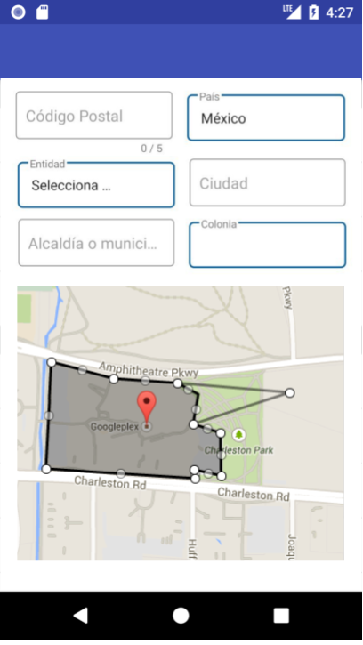

# Android Technical Challenge
Create an app that renders the poligon of a given zip code and fill the fields related to an address

Your solution must:

- Look as close to the design as you can make it; ensure you pay attention to detail
- Have code that you consider to be of production quality
- Use this `https://poligonos-wje6f4jeia-uc.a.run.app/zip-codes/01210`  to fetch the geoJSON data of a given zip code
- Use this `https://sepomex-wje6f4jeia-uc.a.run.app/api/zip-codes/01210`  to fetch zip code settlements and details
- Render the geoJSON data of the zip code into a google map frame 
- Fill the fields related to the address after fetch the zip code data from the service above
- Catch the errors when the service returns an error code

Feel free to add comments explaining any decisions you've made that are note worthy in the code, alternatively you can add a README file with more details if you think it will help explain your solution design decisions.
